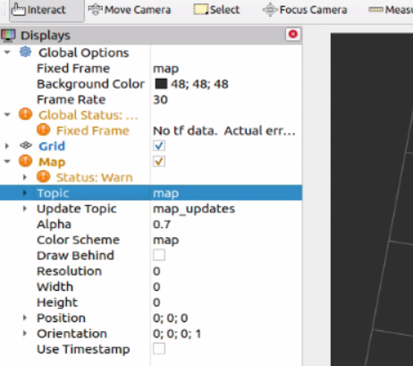
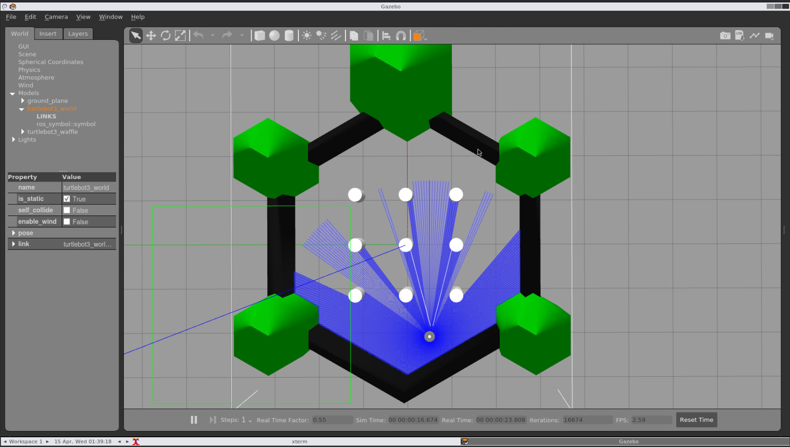
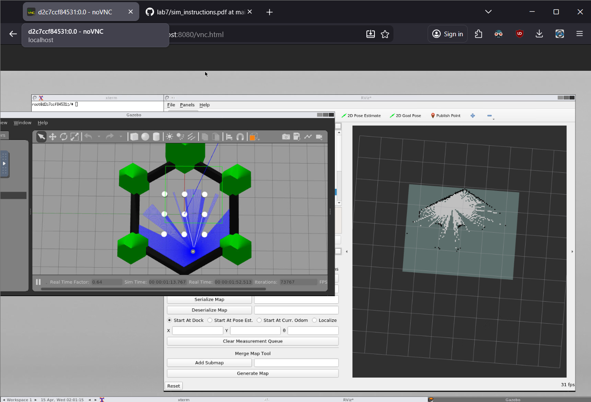
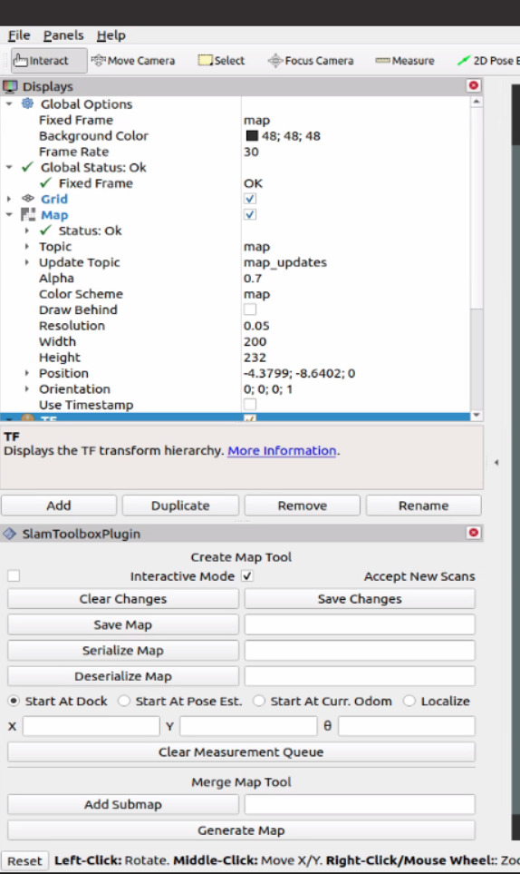
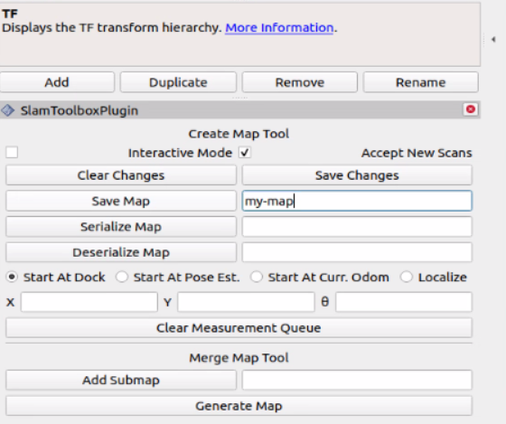
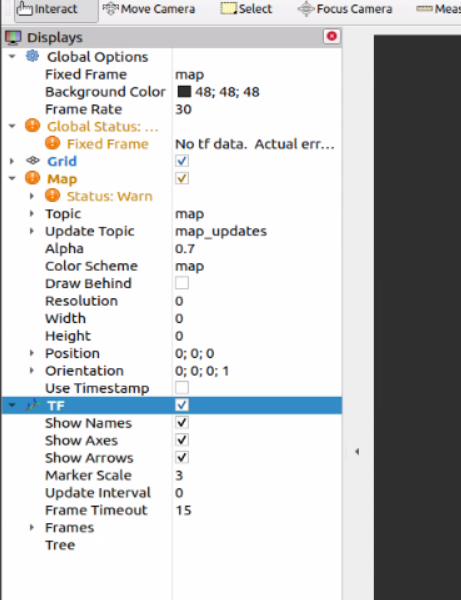
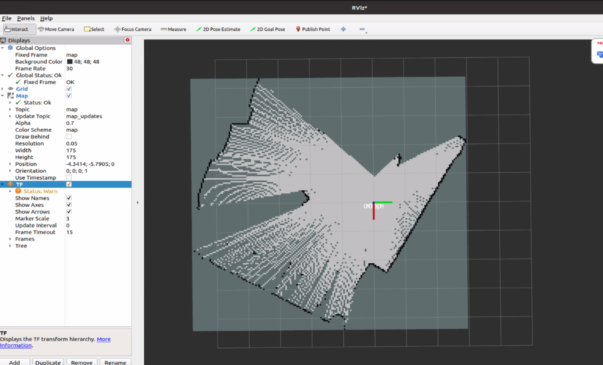
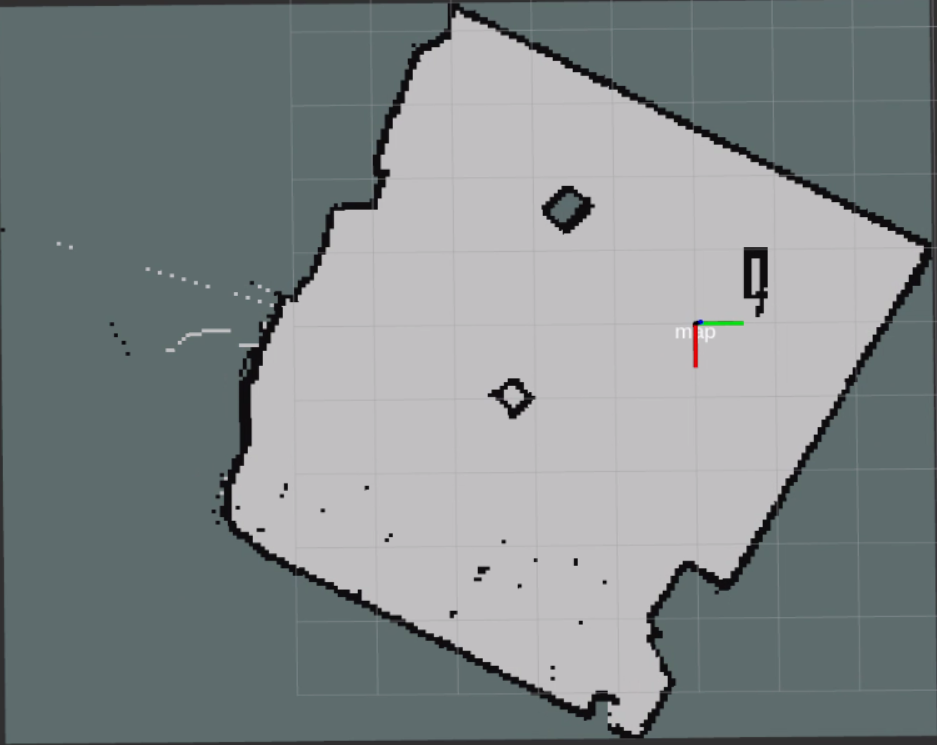

# Lab: SLAM

In this lab, you'll learn how to use **Simultaneous Mapping and Localization (SLAM)** in order to create maps.

Deliverables:

* Simulator demonstration: **15** points
* Vehicle demonstration: **15** points

Learning Goals:

* Learn how to use SLAM to create maps in the simulator and on the vehicle.

## Part 1: SLAM in the Simulator

In this section, you'll be performing SLAM inside your simulator environment to produce a map. We will be using `turtlebot3_gazebo` to simulate the physical car (instead of the F1Tenth gym in RViz). However, we will still use RViz to display the map while it's being constructed.

### 1-1: Installation

Use the following commands inside your container to install `turtlebot3_gazebo` and `slam_toolbox`:

```bash
apt install ros-foxy-turtlebot3-gazebo
apt install ros-foxy-slam-toolbox
```

**Note**: If you rebuild your container, you will need to reinstall these packages.

### 1-2: Running SLAM

**NOTE**: Your simulator environment might be REALLY slow!

Next, we'll run our environment. First, start up **four terminals** and make sure they have all sourced the underlay.

#### Terminal 1: RViz

First, in the first terminal, run:

```
rviz2
```

In RViz, add a new **Display** of display type **Map**. Then, set the topic to `/map`. This is what the panel for the display should look like:



RViz is where you'll be see the map under construction in `slam_toolbox`.

#### Terminal 2: Teleop

In your second terminal, run:

```
ros2 run teleop_twist_keyboard teleop_twist_keyboard
```

You'll use this to drive the vehicle in Gazebo.

#### Terminal 3: Gazebo

In your third terminal, run:

```
TURTLEBOT3_MODEL=waffle ros2 launch turtlebot3_gazebo turtlebot3_world.launch.py
```

This will run Gazebo and load the "waffle" model, as seen below:



#### Terminal 4: `slam_toolbox`

Finally, run:

```
cd /sim_ws
ros2 launch slam_toolbox online_async_launch.py
```

This will start running `slam_toolbox` with its default configuration.

#### Mapping

First, ensure that both the Gazebo window and RViz window are both visible, like this:



Now, using Terminal 3 (teleop), drive around the map, careful to avoid any obstacles. You are done mapping once the entire inside of the hexagon is mapped.

Once you complete your map, add a new panel using "Panels" then "Add New Panel". Then, under "slam_toolbox" add "SlamToolboxPlugin". Once you do, it will show a panel in the bottom left:



Once you are finished, enter in a good name for the map (e.g. `my-map`) next to the "Save Map" button, **without any file extensions or slashes (`/`)**. Once you are finished, click the "Save Map" button:



Now, since we've launched `slam_toolbox` in `/sim_ws`, the map will be saved in that directory. Navigate to that directory to see that it's there:

```
cd ~/ws/maps
ls
```

If you gave it the name `my-map`, then the map files would be named `my-map.pgm` and `my-map.yaml`.

### 1-3: Simulator Demonstration

Go through the process as described above and show your car moving through the Gazebo environment, constructing a map as it moves. Then, save the map and show the contents of its files.

## Part 2: SLAM on the Vehicle

This section covers how you use SLAM on the vehicle.

### 2-1: Running SLAM on the vehicle

Log in on your account on the vehicle on the Desktop.

Open a new "Terminal" window, and open three terminals (three tabs).

In terminal 1, run RViz:

```
rviz2
```

Inside of RViz, ensure that there is a visualization of display type **Map**, and it's listening to the `/map` topic:


Then, add a **TF** visualization and enable **Show Names** and set **Marker Scale** to 3:



In terminal 2, launch the stack:

```
ros2 launch f1tenth_unlv_veh stack_launch.py
```

Wait for the stack to fully start up, and ensure that you can use the controller to move the wheels.

In terminal 3, go inside `~/ws/maps` and launch `slam_toolbox` using the custom parameter file found in `f1tenth_unlv_veh`:

```
cd ~/ws/maps
ros2 launch slam_toolbox online_async_launch.py params_file:=${HOME}/ws/src/f1tenth_unlv_veh/config/f1tenth_online_async.yaml
```

On success, you will see the map starting to be made in RViz:



If the map doesn't show up in RViz, stop the stack and `slam_toolbox` (using Ctrl+C), and go back to the step where you launch the stack. It is important that you launch the stack **first**, wait until it's ready, **then** launch `slam_toolbox`.

Once you see that your map is being constructed, use your controller to drive around the map. **Try not to hit any obstacles,** or else it might mess with the construction of the map.

You may need to drive around multiple times to clean up some segments of the map. If the map gets messed up along the way, then restart your stack and `slam_toolbox`. Below is an example of a fully completed map:



Once you complete your map, add a new panel using "Panels" then "Add New Panel". Then, under "slam_toolbox" add "SlamToolboxPlugin". Once you do, it will show a panel in the bottom left:


Enter in the name `my-map` next to the "Save Map" button, **without** any file extensions or slashes (`/`). Once you are finished, click the "Save Map" button:


Now, since we've launched `slam_toolbox` in `~/ws/maps`, the map will be saved in that directory. Navigate to that directory to check:

```
cd ~/ws/maps
ls
```

You should see two files `my-map.pgm` and `my-map.yaml` in the list.

### 2-2: Vehicle Demonstration

To complete your vehicle demonstration, successfully create a map using SLAM and export it to `.pgm` and `.yaml` files.
